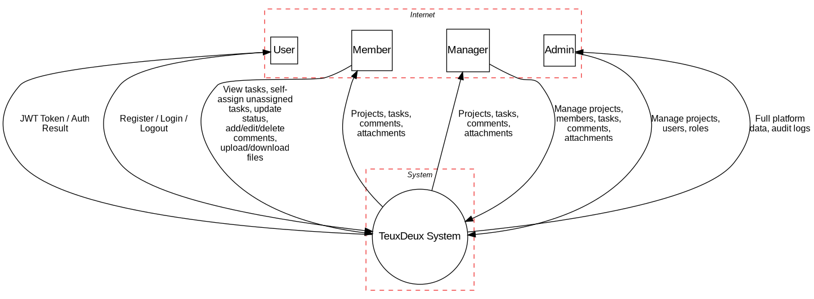
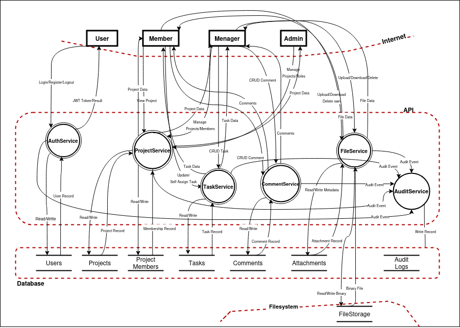
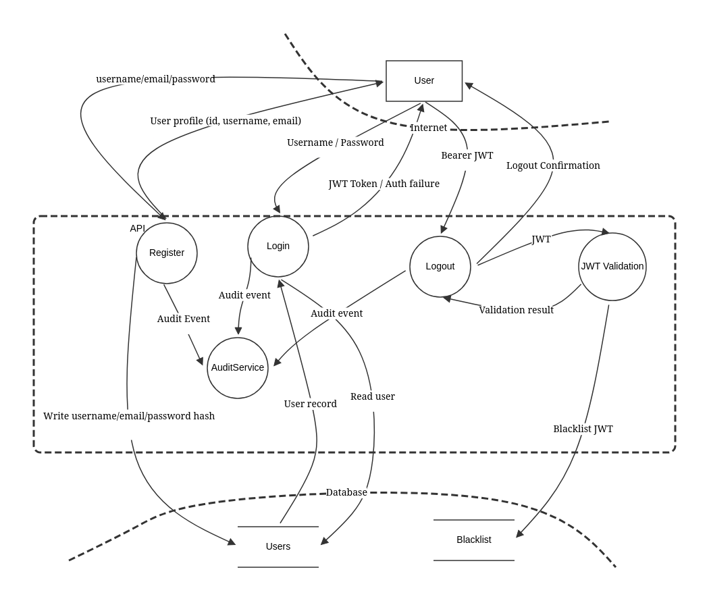

# Threat Modeling - STRIDE Analysis

**Implementation Details:** See 04_SecurityDesign.md for all security implementations

## Threat Modeling Diagrams

- DFD Level 0: 
- DFD Level 1: 
- DFD Level 2 (Authentication): 

---

## Risk Score Calculation

**L (Likelihood):** Probability of attack occurrence (1-5 scale)
- 1 = Very unlikely (requires specialized access/knowledge)
- 5 = Very likely (trivial, automated tools available)

**I (Impact):** Severity if threat succeeds (1-5 scale)
- 1 = Insignificant (minimal damage)
- 5 = Catastrophic (total data loss, system compromise)

**Score = L × I:** Risk priority
- Score ≥ 15: P0 Critical (implement immediately)
- Score 12-14: P1 High (implement in Phase 1)
- Score < 12: P2 Medium (nice-to-have)

---

## System Overview

**Architecture:** REST API-only backend
- Clients ← HTTPS → API Server
- API Server ← SQL ← PostgreSQL Database
- API Server ↔ File Storage (local filesystem)

**In Scope Threats:**
- Authentication (login, token management)
- Authorization (RBAC enforcement)
- Data Access (database queries)
- File Operations (upload, download, storage)
- Audit Logging

**Threat Model Inputs:**
- Assets inventory: [Assets.md](Assets.md)
- Entry/exit surface: [EntryPoints.md](EntryPoints.md), [ExitPoints.md](ExitPoints.md)
- Trust assumptions: [TrustLevels.md](TrustLevels.md)

---

## Trust Boundaries

**Boundary 1:** User ↔ API (input validation, authentication)
**Boundary 2:** API ↔ Database (parameterized queries, authorization)
**Boundary 3:** API ↔ Filesystem (access control, path validation)

---

## STRIDE Threat Analysis

### Authentication Threats (Spoofing & Info Disclosure)
Focus on interactions with the **AuthService** and the traffic that crosses the **Internet** boundary.

| ID | Threat                                           | L | I | Score | Mitigation                                                    |
|----|--------------------------------------------------|---|---|-------|---------------------------------------------------------------|
| T1 | Brute force/Credential stuffing on `AuthService` | 4 | 5 | 20    | M1: Rate limiting by IP/User, account lockout mechanisms      |
| T2 | JWT token interception over `Internet`           | 3 | 5 | 15    | M2: Mandatory TLS 1.2+ for all traffic, Secure/HttpOnly flags |
| T3 | Weak password generation                         | 3 | 4 | 12    | M3: Enforce password complexity (min 12 chars, entropy check) |

### Authorization Threats (Elevation of Privilege & Info Disclosure)
Focus on access controls between roles (User, Member, Manager, Admin) in the various services.

| ID | Threat                                                   | L | I | Score | Mitigation                                                      |
|----|----------------------------------------------------------|---|---|-------|-----------------------------------------------------------------|
| T4 | Role escalation to `Admin` or `Manager`                  | 3 | 5 | 15    | M4: Strict server-side RBAC validation from DB on every request |
| T5 | IDOR (Insecure Direct Object Reference) on `TaskService` | 4 | 4 | 16    | M5: Validate resource ownership/membership against JWT claims   |
| T6 | Unauthorized project modification via `ProjectService`   | 3 | 5 | 15    | M6: Authorization middleware matching user role to project ID   |

### File Upload Threats (Tampering, DoS & Info Disclosure)
Focus on the **FileService** and writing/reading in the **Filesystem (FileStorage)**.

| ID | Threat                                          | L | I | Score | Mitigation                                                                       |
|----|-------------------------------------------------|---|---|-------|----------------------------------------------------------------------------------|
| T7 | Malicious executable upload to `FileStorage`    | 4 | 5 | 20    | M7: Strict MIME validation, malware scanning, remove execute permissions on disk |
| T8 | Storage exhaustion DoS (mass uploads)           | 4 | 4 | 16    | M8: File size limits (e.g., 25MB), user/tenant quota enforcement                 |
| T9 | Path traversal leading to arbitrary file access | 3 | 4 | 12    | M9: Strip paths from filenames, store files using UUIDs                          |

### Data Access Threats (Tampering & Info Disclosure)
Focus on the boundary between the **API** and the **Database**.

| ID  | Threat                                       | L | I | Score | Mitigation                                                               |
|-----|----------------------------------------------|---|---|-------|--------------------------------------------------------------------------|
| T10 | SQL/NoSQL Injection via API services         | 3 | 5 | 15    | M10: Use ORM or strictly parameterized queries everywhere                |
| T11 | Exposure of PII/Credentials in `Users` table | 2 | 5 | 10    | M11: Strong hashing (Argon2id/Bcrypt) for passwords, encrypt PII at rest |

### Application Threats (Tampering & Repudiation)
Focus on user interactions with the **CommentService** and state transitions.

| ID  | Threat                               | L | I | Score | Mitigation                                                               |
|-----|--------------------------------------|---|---|-------|--------------------------------------------------------------------------|
| T12 | Stored XSS via `CommentService`      | 4 | 4 | 16    | M12: Strict input validation and context-aware output encoding           |
| T13 | Repudiation of critical task changes | 2 | 4 | 8     | M13: Ensure `TaskService` cannot bypass `AuditService` for state changes |

### Logging Threats (Tampering & Repudiation)
Focus on the **AuditService** and the **Audit Logs** table.

| ID  | Threat                                     | L | I | Score | Mitigation                                                         |
|-----|--------------------------------------------|---|---|-------|--------------------------------------------------------------------|
| T14 | Audit log tampering by compromised `Admin` | 2 | 5 | 10    | M14: Use append-only or write-only DB credentials for `Audit Logs` |
| T15 | Sensitive data leakage in audit events     | 3 | 4 | 12    | M15: Data scrubbing pipeline before writing to `AuditService`      |

---

## Risk Assessment Matrix

**Critical Priority (P0) - Score ≥ 15:**
* T1 (Brute force): 20 - M1 rate limiting
* T7 (Malicious upload): 20 - M7 MIME validation & execution prevention
* T5 (IDOR on Tasks): 16 - M5 ownership validation
* T8 (Storage DoS): 16 - M8 file limits & quotas
* T12 (Stored XSS): 16 - M12 input/output sanitization
* T2 (JWT interception): 15 - M2 TLS enforcement
* T4 (Role escalation): 15 - M4 strict RBAC
* T6 (Unauth project mod): 15 - M6 authz middleware
* T10 (Injection): 15 - M10 parameterized queries

**High Priority (P1) - Score 12-14:**
* T3 (Weak password): 12 - M3 complexity checks
* T9 (Path traversal): 12 - M9 UUID storage
* T15 (Log sensitive data): 12 - M15 data scrubbing

**Medium Priority (P2) - Score < 12:**
* T11 (DB exposure): 10 - M11 hashing/encryption
* T14 (Log tampering): 10 - M14 append-only logs
* T13 (Repudiation of changes): 8 - M13 mandatory audit hooks

---

## Threat-to-Mitigation Mapping

**P0 Mitigations Required for Phase 1 (Core Security):**
* M1: Implement rate limiting on `AuthService`.
* M2: Enforce TLS 1.2+ across the Internet boundary.
* M4, M6: Implement robust role and membership authorization middleware.
* M5: IDOR protection (validate JWT ownership against Task/Project IDs).
* M7: File upload MIME validation and secure filesystem permissions.
* M8: Enforce max file size globally on `FileService`.
* M10: Parameterize all Database queries.
* M12: Implement anti-XSS encoding in frontend/API responses.

**P1 Mitigations Required for Phase 1 (Hygiene & Stability):**
* M3: Password complexity policies in `AuthService`.
* M9: UUID-based file naming convention in `FileStorage`.
* M15: Implement a log scrubber for the `AuditService`.

**P2 Mitigations (Phase 2 / Hardening):**
* M11: Database-level encryption at rest.
* M13: Comprehensive audit coverage for every CRUD operation.
* M14: Append-only database user for `Audit Logs`.